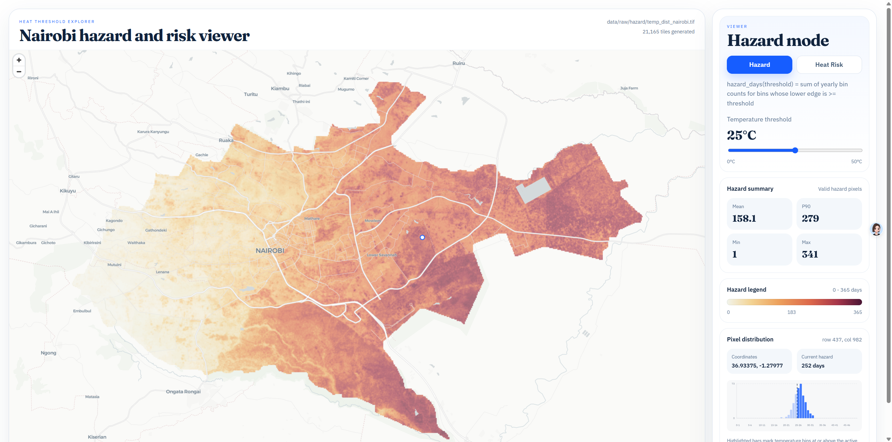
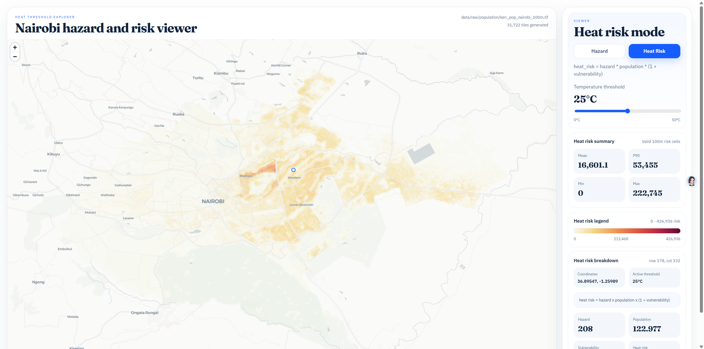

# Nairobi Heat Hazard and Risk Viewer

A research prototype for exploring two linked indicators over Nairobi:

- `Hazard`: days at or above a temperature threshold
- `Heat Risk`: `hazard x population x (1 + vulnerability)`

The project uses a React frontend with pre-generated raster tiles and click-query chunks. Hazard is shown on the original Nairobi hazard grid, while Heat Risk is computed on the aligned 100m population grid.

## Screenshots

### Hazard Mode



### Heat Risk Mode



## Repository Layout

### Source code

- `frontend/` React + TypeScript + Vite app
- `scripts/` raster preprocessing scripts
- `tests/` Python tests for preprocessing logic

### Input data kept in the repo

- `data/raw/hazard/temp_dist_nairobi.tif`
- `data/raw/population/ken_pop_nairobi_100m.tif`
- `data/raw/vulnerability/population_composite_nairobi.tif`

### Local-only preprocessing input not committed

- `data/raw/population/ken_pop_2025_CN_100m_R2025A_v1.tif`
  - Used only to produce the Nairobi-cropped population raster.
  - Not required for running the app if `ken_pop_nairobi_100m.tif` is already present.

### Generated files not committed

- `frontend/public/data/` generated tiles and metadata
- `data/derived/` derived helper rasters
- `frontend/dist/`, `frontend/node_modules/`, `.vite/`, `*.tsbuildinfo`

## Features

- Hazard / Heat Risk mode switch
- Shared temperature-threshold slider
- Smooth map updates without recreating the map
- Hazard pixel inspection with full yearly temperature distribution
- Heat Risk cell inspection with hazard, population, vulnerability, and risk breakdown
- Administrative boundaries and labels stay visible above raster content

## Requirements

- Python 3.12+
- Node.js 24+
- npm

## Data Generation

The frontend reads generated files from `frontend/public/data/`. Those files are not committed, so a fresh clone needs one preprocessing step before the site can display the rasters.

The tile build writes:

- `frontend/public/data/tiles/` raster tiles used by the map
- `frontend/public/data/pixels/` click-query chunks
- `frontend/public/data/metadata.json` metadata used by the frontend

If these files are missing, the site will load but the raster layers will not appear.

## Setup

1. Install Python dependencies for tile generation

```powershell
python -m pip install -r requirements.txt
```

2. Install frontend dependencies

```powershell
npm --prefix frontend install
```

3. Generate frontend-ready raster assets and tiles

```powershell
npm run data:build
```

By default, this command reads `data/raw/hazard/temp_dist_nairobi.tif` and rebuilds the generated viewer assets under `frontend/public/data/`.

The repo also includes the Nairobi-level population and vulnerability rasters used by the project:

- `data/raw/population/ken_pop_nairobi_100m.tif`
- `data/raw/vulnerability/population_composite_nairobi.tif`

Keep any extended preprocessing outputs under `frontend/public/data/` so the frontend can load them without path changes.

4. Start the development server

```powershell
npm run dev
```

## Build and Test

Run preprocessing and frontend tests:

```powershell
npm run test
```

Build the frontend:

```powershell
npm run build
```

## Notes

- The repo keeps the Nairobi-level input rasters so others can reproduce the generated web assets locally.
- The full-country Kenya population raster is intentionally excluded from version control because it is large and only needed for the one-time crop step.
- Generated tiles are intentionally excluded from version control because they are large and can be rebuilt with `npm run data:build`.
- If you change any raw raster input, rerun `npm run data:build` before starting the frontend.
