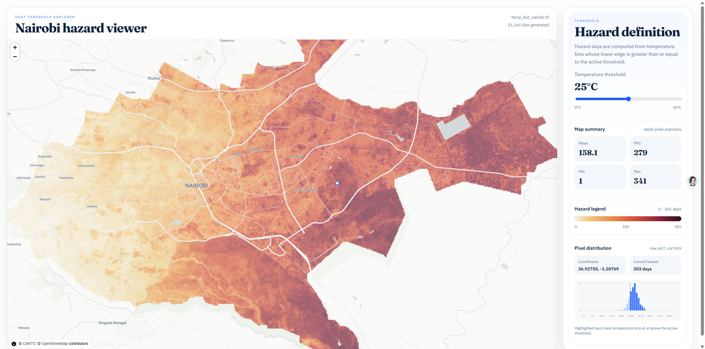

# Nairobi Heat Hazard Viewer

A research prototype for visualizing and analyzing heat hazard data over Nairobi. The application generates multi-level heat hazard tiles from GeoTIFF data and provides an interactive React-based interface with real-time threshold adjustment and pixel-level temperature distribution analysis.



## Features

- **Interactive Map Display**: Visualize hazard days (temperature ≥ threshold) across Nairobi with multi-level zoom support
- **Real-time Threshold Adjustment**: Dynamically adjust temperature thresholds and see instant map updates
- **Pixel-Level Analysis**: Click any pixel to view detailed temperature distribution across 50 temperature bins for the entire year
- **Statistical Summary**: View aggregated statistics and heat hazard legend for the complete dataset
- **Responsive UI**: Split-panel layout with map on the left and control panel on the right

## Project Structure

```
├── frontend/              # React + TypeScript frontend
│   ├── src/
│   │   ├── App.tsx       # Main application component
│   │   ├── components/   # React components
│   │   ├── types.ts      # TypeScript type definitions
│   │   └── styles.css    # Styling
│   ├── public/
│   │   └── data/         # Pre-generated hazard tiles and metadata
│   └── vite.config.ts    # Vite configuration
├── scripts/              # Python build scripts
│   └── build_hazard_tiles.py    # Generates tiles from GeoTIFF
└── tests/               # Test suite
```

## Installation

### Prerequisites
- Python 3.8+
- Node.js 16+
- npm

### Setup Steps

1. **Generate static hazard tile data**

```bash
python scripts/build_hazard_tiles.py --clean
```

This processes `temp_dist_nairobi.tif` and generates multi-level WebGL/tile data.

2. **Install frontend dependencies**

```bash
npm --prefix frontend install
```

3. **Start the development server**

```bash
npm run dev
```

From the `frontend` directory, you can alternatively run `npm run dev` directly.

## Usage

- **Left Panel**: Interactive map showing hazard days for the current threshold
- **Right Panel**: 
  - Slider to adjust temperature threshold (°C)
  - Heat hazard legend
  - Summary statistics
- **Click Map Pixels**: Displays a detailed histogram showing temperature distribution for the selected pixel across all 50 temperature bins

## Build

To build for production:

```bash
npm run build
```

The output will be in `frontend/dist/`.

## Technology Stack

- **Frontend**: React 18, TypeScript, Vite
- **Visualization**: Custom WebGL/Canvas-based tile renderer
- **Data Processing**: Python, GDAL/Rasterio
- **Build Tool**: Vite

## License

Research prototype. For academic use.

## About

Based on Nairobi heat hazard analysis from GeoTIFF source data. This tool enables exploration of extreme heat days at multiple temperature thresholds and spatial scales.
